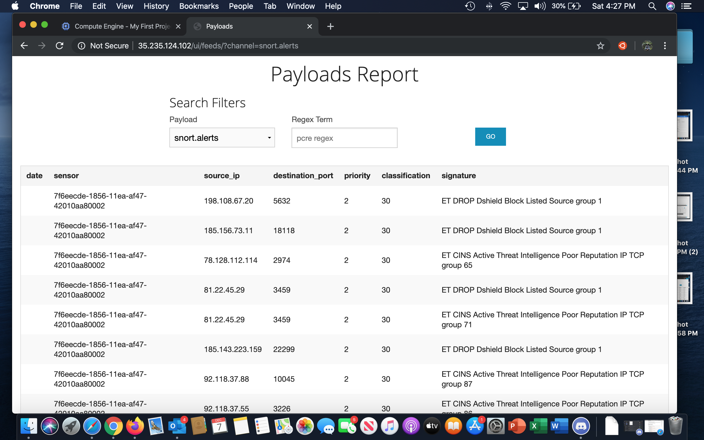
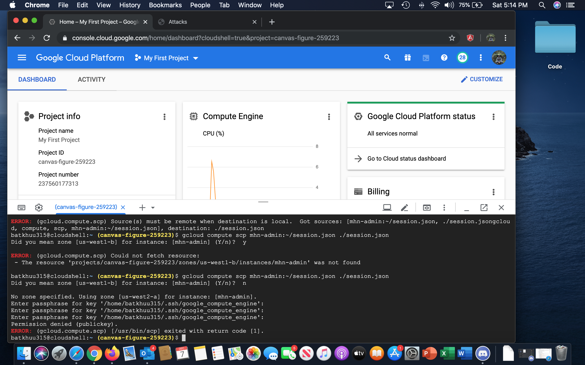

# Week_10-11_Honeypot

# Objective

A honeypot is a decoy application, server, or other networked resource that intentionally exposes insecure features which, when exploited by an attacker, will reveal information about the methods, tools, and possibly even the identity of that attacker. Honeypots are commonly used by security researchers to understand the threat landscape facing developers and system administrators, collecting data.

Setting up a honeypot and intercepting attempted attacks using Modern Honey Network.

# Hours Spent:

~7 Hours

# Honeypots Deployed

# Dionaea
# snort
# suricata

# Summary

The number of attacks to the honeypots deployed as of 12/06/19 are 18,452 includes:
  Dionaea    17979
  Snort      141
  Suricata   332

Some reason my country flag/icon is not showed properly.

# Payloads

# Issues Encountered

Downloading the .json file was a bit complicated, not sure if it was becasue of my computer, or I was running the commands from the wrong instance. I needed more instructions and how to troubleshoot some errors. Luckily I got different instruction of how to download .json file from December 6th class. That is the reason why im submitting my assignment late. Otherwice instructions were easy to follow. 

